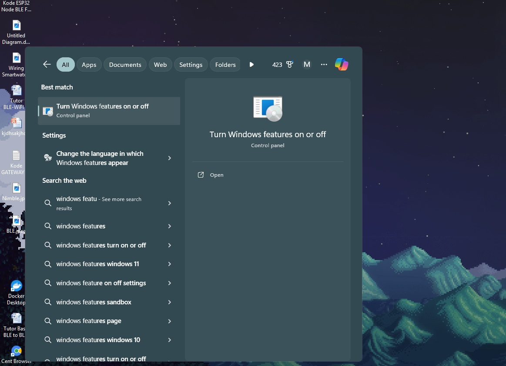
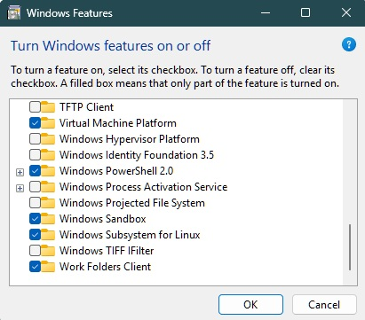
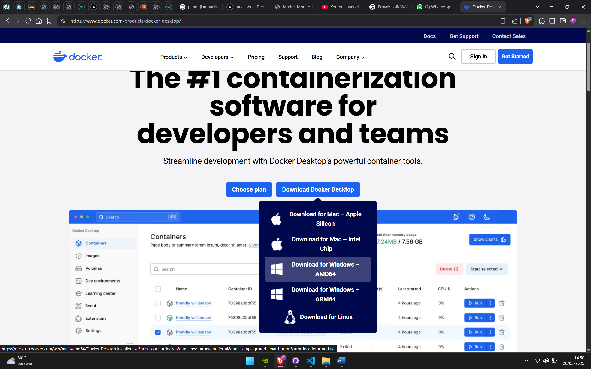
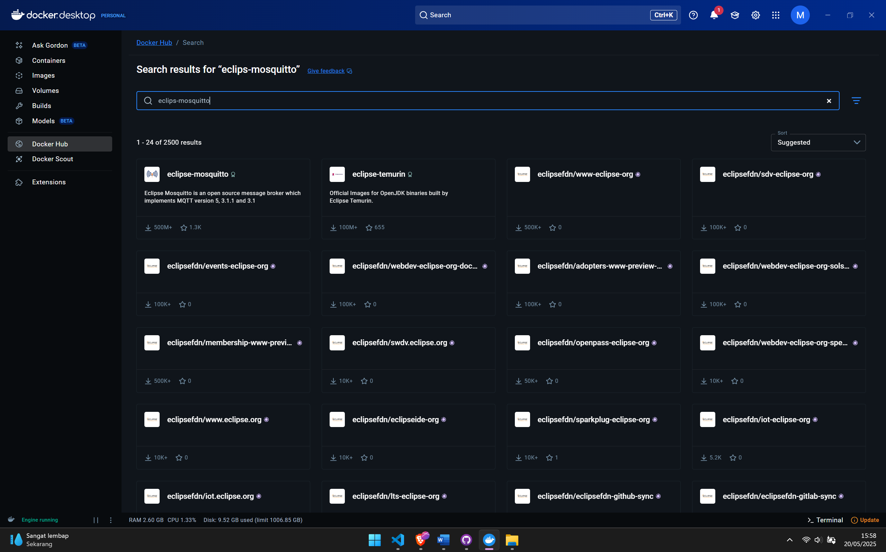
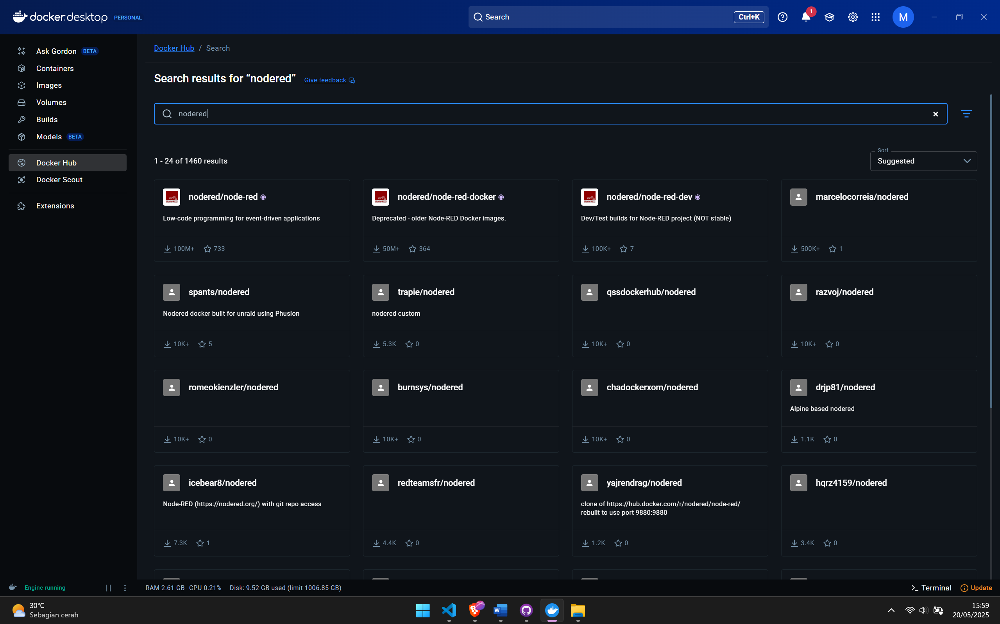

# Dokumentasi Instalasi dan Penggunaan Docker Desktop

MQTT adalah protokol komunikasi ringan yang digunakan untuk berbagi pesan antara perangkat dalam jaringan IoT (Internet of Things). Broker adalah server yang bertanggung jawab untuk menerima, menyimpan, dan meneruskan pesan antara klien yang terhubung. Salah satu dari Server MQTT Broker adalah Mosquitto.

Node-RED adalah platform berbasis flow-based programming yang menggunakan antarmuka drag-and-drop untuk membuat flow serangkaian blok atau node yang saling terhubung guna menjalankan berbagai fungsi secara otomatis.

Docker Desktop digunakan untuk membuat, mengelola, dan menjalankan container dengan lebih mudah tanpa harus mengonfigurasi Docker secara manual di sistem operasi.

## Penjelasan Fitur Utama pada Docker Desktop

- **Containers**  
  Instance dari image yang berjalan secara terisolasi untuk menjalankan aplikasi atau service.  
  *Contoh:*  
  ```
  docker run -d -p 8080:80 --name webserver nginx
  ```

- **Images**  
  Template read-only berisi sistem file, dependensi, dan aplikasi yang dibutuhkan untuk menjalankan container.  
  *Contoh:*  
  ```
  docker pull nodered/node-red
  ```

- **Volumes**  
  Penyimpanan data persisten di luar lifecycle container.  
  *Contoh:*  
  ```
  docker volume create data-volume
  docker run -d -v data-volume:/data --name nodered nodered/node-red
  ```

- **Builds**  
  Proses membuat image baru dari Dockerfile.  
  *Contoh:*  
  ```
  docker build -t my-custom-image .
  ```

- **Docker Hub**  
  Registry online untuk berbagi dan mengelola image Docker.  
  *Contoh:*  
  ```
  docker pull eclipse-mosquitto
  ```
- **Docker Scout**  
  Fitur analisis keamanan dan kerentanan pada image Docker melalui menu "Scout" di Docker Desktop.

- **Extensions**  
  Fitur tambahan untuk memperluas fungsionalitas Docker Desktop, misal integrasi monitoring/database.

---

## Tahapan Instalasi dan Penggunaan Docker Desktop, Node-RED, dan Mosquitto

### 1. Instalasi WSL 2 (Khusus Windows)

- **Untuk pengguna Windows:**  
  Docker Desktop pada Windows membutuhkan WSL 2 (Windows Subsystem for Linux versi 2) sebagai backend default untuk menjalankan container Linux.  
  Jika WSL 2 belum terinstal, Docker Desktop akan memandu proses instalasinya saat pertama kali dijalankan.  
  **Jadi, ya—Anda perlu menginstal WSL 2 agar Docker Desktop dapat berjalan optimal di Windows.**

- **Untuk pengguna Mac:**  
  Tidak perlu menginstal WSL. Docker Desktop berjalan langsung di atas sistem operasi Mac.

#### Langkah Instalasi WSL 2 di Windows 11

- Sebelum instal Docker Desktop, cari **Windows Feature** dengan cara tekan **Win + S**.

  

- Lalu cari dan ceklis **Windows Subsystem for Linux**, lalu OK. Setelah itu lanjut dengan:
    1. Buka PowerShell sebagai Administrator.
    2. Jalankan:
       ```
       wsl --install
       ```
       (Akan menginstal WSL 2 dan Ubuntu otomatis. Restart jika diminta.)
    3. Cek versi WSL:
       ```
       wsl --list --verbose
       ```
       Pastikan distro Linux menggunakan versi 2. Jika perlu, ubah ke WSL 2:
       ```
       wsl --set-version <nama-distro> 2
       ```
    4. Set default ke WSL 2:
       ```
       wsl --set-default-version 2
       ```
    5. Jika diminta update kernel, download dari [https://aka.ms/wsl2kernel](https://aka.ms/wsl2kernel)
    6. Jalankan:
       ```
       wsl
       ```
       Jika masuk terminal Linux, WSL sudah aktif.
    7. Di akhir instalasinya buatlah Username dan Password.

  

---

### 2. Instalasi Docker Desktop

- **Download Docker Desktop**
  - Kunjungi [https://www.docker.com/products/docker-desktop/](https://www.docker.com/products/docker-desktop/)
  - Pilih versi sesuai sistem operasi (Windows/Mac).

  

- **Install Docker Desktop**
  - Jalankan installer yang telah diunduh.
  - Ikuti instruksi instalasi hingga selesai.
  - Setelah instalasi, restart komputer jika diminta.

- **Verifikasi Instalasi**
  - Buka Command Prompt atau PowerShell.
  - Jalankan:
    ```
    docker --version
    ```
  - Pastikan versi Docker muncul.

---

### 3. Menjalankan Docker Desktop

- Buka aplikasi Docker Desktop dari Start Menu.
- Pastikan status Docker “Running”.

---

### 4. Menarik (Pull) Image Node-RED dan Mosquitto

**Melalui GUI Docker Desktop:**
- Buka tab **Images** atau **Docker Hub**.
- Cari dan pull image berikut:
  - `nodered/node-red`
  - `eclipse-mosquitto`

  
  

---

### 5. Menjalankan Container Node-RED dan Mosquitto

**Node-RED:**
- Klik **Run** pada image `nodered/node-red`.
- Atur port mapping: Host `1880` → Container `1880`.
- Nama container: `nodered`.
- Klik **Run**.
- Akses di browser: [http://localhost:1880](http://localhost:1880)

**Mosquitto:**
- Klik **Run** pada image `eclipse-mosquitto`.
- Atur port mapping: Host `1883`
- Nama container: `mosquitto`.
- Klik **Run**.
- MQTT broker aktif di `localhost:1883`.

**Konfigurasi tambahan Mosquitto:**
- Untuk mengatur konfigurasi MQTT, edit file `mosquitto.conf` pada container Mosquitto:
  - Buka tab **Containers** → pilih **mosquitto** → cari file `mosquitto.conf`.
  - Tambahkan baris berikut:
    ```
    allow_anonymous true
    listener 1883
    listener 9001
    protocol websockets
    persistence true
    persistence_file mosquitto.db
    persistence_location /mosquitto/data/
    ```

---

### 6. Cek Status Container

- Buka tab **Containers** di Docker Desktop.
- Pastikan container `nodered` dan `mosquitto` berstatus **Running**.

---

### 7. Menghubungkan Node-RED ke Mosquitto

- Buka Node-RED di browser (`http://localhost:1880`).
- Tambahkan node `mqtt in` atau `mqtt out`.
- Konfigurasi server MQTT:
  - Server: `localhost`
  - Port: `1883`
- Deploy flow untuk mulai komunikasi MQTT.

---

### 8. Testing

- Gunakan node `inject` dan `debug` di Node-RED untuk mengirim/menerima pesan MQTT.
- Bisa juga menggunakan aplikasi MQTT client lain (misal MQTT Explorer) untuk testing.

---
