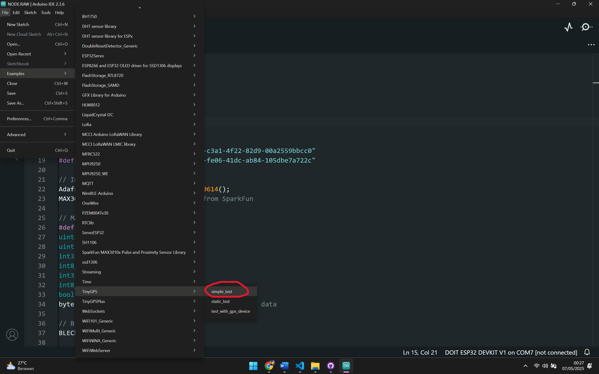

# MATKUL_KEAMANAN-JARINGAN

## A. Langkah-Langkah Penggunaan
### 1. Merangkai wiring sesuai gambar

### 2. Menginstal library yg diperlukan, seperti:
2.1 ESP32 Node
- Sparkfun MAX3010x Pulse and Proximity…
- Adafruit MLX90614 by Adafruit

2.2 ESP32 Gateway
- MPU9250_WE by Wolfgang Ewald…
- TinyGPSPlus by Mikal Hart

### 3. Mencoba setiap sensor dengan kode example library-nya masing-masing, seperti:
3.1. ESP32 Node
- Sparkfun MAX3010x Pulse and Proximity

- Adafruit MLX90614 by Adafruit

3.2. ESP32 Gateway
- MPU9250_WE by Wolfgang Ewald…

- Neo-6M6 TinyGPSPlus by Mikal Hart

### 4. Salin kode Node dan Gateway-nya ke Arduino IDE
Jika sudah berhasil membaca/muncul di serial monitor dan tidak ada error, Lanjut ke github, copy kode Node dan Gateway-nya ke Arduino IDE. [Link github](https://github.com/mhmdnvn18/MATKUL_KEAMANAN-JARINGAN/tree/main/1.BASIC)

### 6. Mengubah UUID
Sebelum upload, ubah dulu kedua UUID-nya pada node atau gateway dengan website UUID Generator. [WEBSITE UUID GENERATOR](https://www.uuidgenerator.net/)

Generate dan tambahkan kedalam kode lalu samakan UUID-nya antara UUID pada kode Node dan Gateway.
- KODE UUID GATEWAY

- KODE UUID NODE

### 7. CATATAN
- Selalu ingat nomor port untuk ESP32 Node dan ESP32 Gateway dan setiap upload program (kode)
- Restart ESP32, dengan menekan tombol EN pada board ESP32

## B. Penjelasan Program Arduino

### 1. NODE (NODE.ino)
**NODE** adalah program untuk ESP32 yang berfungsi sebagai node sensor kesehatan.  
Fitur utama:
- Membaca suhu tubuh menggunakan sensor **MLX90614**.
- Mengukur detak jantung (BPM) dan kadar oksigen darah (SpO2) menggunakan sensor **MAX30105**.
- Menggunakan dua jalur I2C (`Wire` dan `Wire1`) untuk menghubungkan kedua sensor secara bersamaan.
- Mengirimkan data hasil pengukuran (suhu, BPM, SpO2) ke perangkat lain melalui koneksi **Bluetooth Low Energy (BLE)** dengan UUID service dan characteristic tertentu.
- Data dikirim secara periodik jika jari terdeteksi pada sensor MAX30105.

---

### 2. GATEWAY (GATEWAY.ino)
**GATEWAY** adalah program untuk ESP32 yang berfungsi sebagai penerima data dari NODE dan juga sebagai pengumpul data lingkungan.  
Fitur utama:
- Berperan sebagai **BLE client** yang mencari dan terhubung ke NODE (BLE server) berdasarkan UUID service yang sama.
- Menerima data kesehatan (suhu, BPM, SpO2) dari NODE melalui BLE notification.
- Membaca data sensor gerak (**MPU6500**) untuk mendapatkan nilai akselerasi dan gyroscope.
- Membaca data lokasi (latitude, longitude, altitude) dan jumlah satelit dari modul **GPS Neo-6M**.
- Menampilkan seluruh data (dari NODE, sensor gerak, dan GPS) ke serial monitor untuk pemantauan.

---

### C. Alur Kerja Singkat
1. **NODE** mengukur data kesehatan dan mengirimkannya via BLE.
2. **GATEWAY** mencari NODE, terhubung, dan menerima data kesehatan.
3. **GATEWAY** juga membaca data sensor gerak dan GPS, lalu menampilkan semua data ke serial monitor.

---

### Catatan
- Pastikan kedua ESP32 sudah di-flash dengan program masing-masing dan berada dalam jangkauan BLE.
- Library yang digunakan: `Wire`, `MAX30105`, `Adafruit_MLX90614`, `BLE`, `MPU6500_WE`, `TinyGPSPlus`, dsb.
- Koneksi hardware harus sesuai dengan pin yang tertera di masing-masing program.

